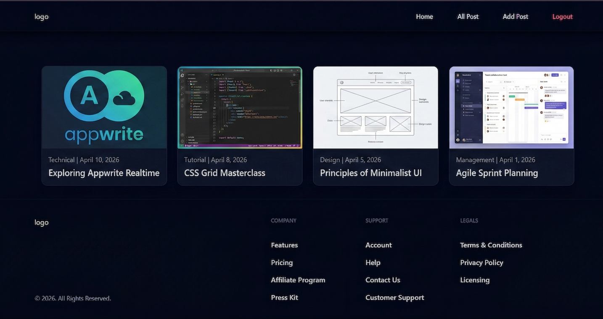
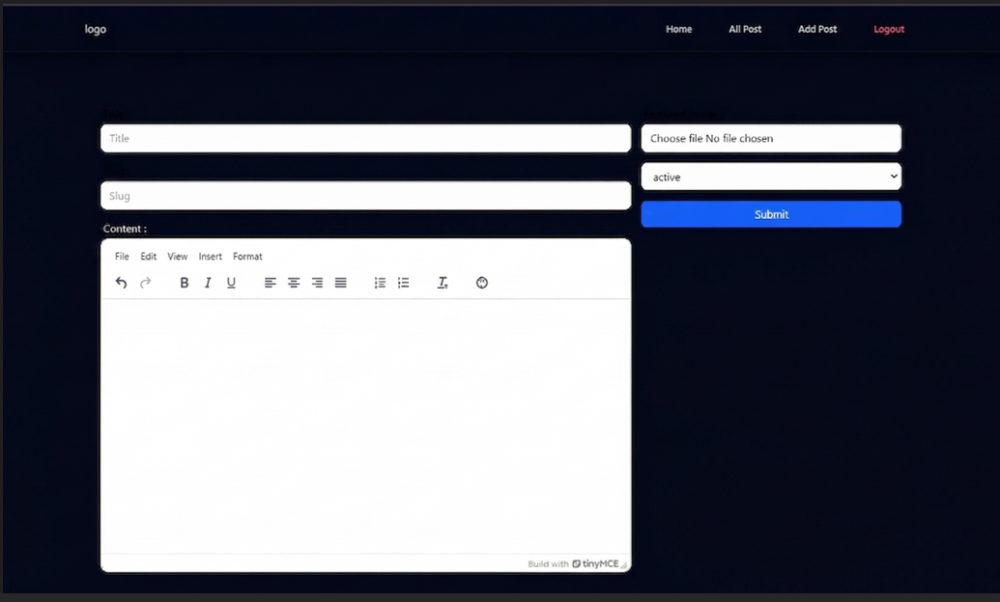
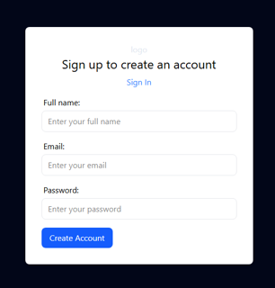

## Tech Stack

- **Appwrite** – handles the backend  
- **TinyMCE** – rich text editor  
- **html-react-parser** – parses HTML into React components  
- **React Hook Form** – handles form state and validation
- **Redux** - for context api(single source of truth) 

# Blog Application — Frontend

A full-featured blog platform built with React, powered by Appwrite as a Backend-as-a-Service (BaaS). Users can sign up, log in, create rich-text blog posts, edit them, and browse all posts — with protected routes and global state management via Redux.

---

## Screenshots

### Home Page
<!--  -->

 

### Create / Edit Post
<!--  -->

 

### Login / Signup
<!--  -->

 

---

## Features

- **User Authentication** — Sign up, log in, and log out using Appwrite Auth
- **Protected Routes** — Auth-guarded pages using a custom `AuthLayout` wrapper
- **Rich Text Editor** — Write and format blog posts using TinyMCE
- **Create / Edit / Delete Posts** — Full CRUD for blog posts stored in Appwrite Database
- **Image Upload** — Post featured images stored in Appwrite Storage Buckets
- **All Posts Feed** — Browse all published posts
- **Single Post View** — Read individual blog posts with parsed HTML rendering
- **Global State Management** — Redux Toolkit used for auth state (single source of truth)
- **Responsive UI** — Styled with Tailwind CSS; dark theme with gradient background

---

## Tech Stack

| Technology | Purpose |
|---|---|
| **React 19** | UI library |
| **Vite** | Build tool & dev server |
| **Appwrite** | Backend-as-a-Service (Auth, Database, Storage) |
| **Redux Toolkit** | Global state management |
| **React Router DOM v7** | Client-side routing |
| **TinyMCE (React)** | Rich text / WYSIWYG editor |
| **html-react-parser** | Parses HTML string from TinyMCE into React components |
| **React Hook Form** | Form state handling and validation |
| **Tailwind CSS v4** | Utility-first CSS styling |

---

